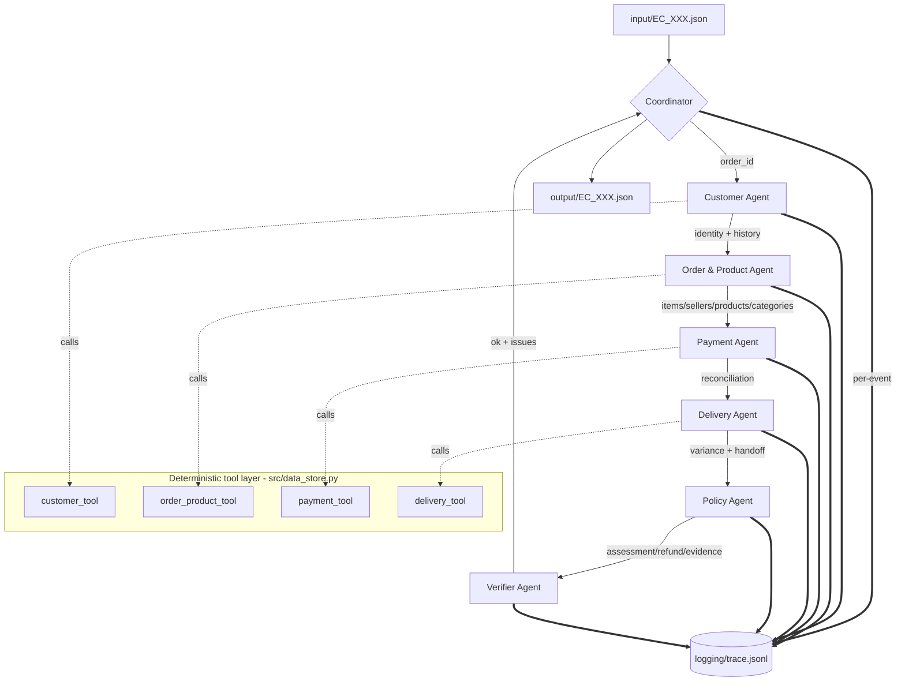

# Architecture — Multi-Agent E-commerce Dispute Resolution (K4 Day 09)

## 1. Overview

The system investigates 50 customer dispute cases against the Olist dataset and
produces one graded JSON per case under `output/`. It is built as **7 cooperating
agents** with explicit handoffs and a final verification stage, orchestrated by a
`Coordinator`.

Core design principle — **LLM decides, tools ground the numbers** (hybrid):

> The **≤10B model owns the core judgment**: the Policy Agent reads a *fact sheet*
> built by the deterministic tools and returns the `primary_issue` by reasoning
> over the `EC_POLICY_V2` priority table in its prompt (plus a confidence). The
> **tools supply every exact number/id** — date/hour variances, money totals,
> counts and objective flags (`delivered_late`, `reconciled`, `late_handoff`) —
> so a 7–8B model never does raw arithmetic and cannot corrupt the figures. From
> the model's decision, the mechanical consequences (refund amount, responsible
> ids, evidence ids, root-cause code, action ordering, secondary flags) are
> derived by lookup over the tool facts.
>
> A deterministic **rule engine** is retained as (a) a **fallback** when no model
> endpoint is reachable or the reply is invalid, and (b) an optional **guardrail**
> (`POLICY_GUARDRAIL=1`) that is always *logged* so the team can measure the
> model's accuracy (`policy_decision_sources` + `llm_vs_rule_disagreements` in
> `metadata.json`). Default: the model's decision stands.

## 2. Agent diagram



## 3. Roles, data access and outputs

| Agent | Role | Data access (least privilege) | Produces |
| ----- | ---- | ----------------------------- | -------- |
| **Coordinator** | Receives case, dispatches in fixed order, assembles output, invokes verifier, writes file | none directly (works on findings) | final output JSON, trace `case_start`/`case_end` |
| **Customer Agent** | Customer identity + order history | `orders`, `customers` | `customer_unique_id`, `related_order_ids` |
| **Order & Product Agent** | Order composition | `order_items`, `products`, `sellers`, category translation | item_ids, seller_ids, product_ids, category_names, item rows (price/freight/shipping_limit) |
| **Payment Agent** | Reconcile payments vs item+freight | `order_payments` (+ totals from Order&Product) | payment_ids, payment_types, totals, `difference`, `reconciled` |
| **Delivery Agent** | Delivery + handoff timing | `orders` timestamps (+ shipping_limit from Order&Product) | delivery_variance, per-seller handoff analysis, late_handoff_seller_ids |
| **Policy Agent** | Apply `EC_POLICY_V2` | none (pure rules over findings) | primary/secondary issue, responsible parties, refund, evidence_ids, actions, confidence |
| **Verifier Agent** | Schema/limits/evidence/null checks | re-derives evidence universe from tools (read-only) | `ok`, `issues[]` |

## 4. Handoff protocol

Agents communicate through **structured finding dictionaries** passed by the
Coordinator (in-process A2A messages). Each handoff is recorded in
`logging/trace.jsonl` as a `handoff` event listing the receiving agent and the
finding keys. The linear order guarantees every downstream agent has the inputs
it needs:

```
Coordinator
  → Customer            (needs: order_id)
  → Order & Product     (needs: order_id)          → feeds Payment + Delivery
  → Payment             (needs: item/freight totals)
  → Delivery            (needs: item rows w/ shipping_limit)
  → Policy              (needs: all four findings + order status)
  → Verifier            (needs: assembled output + evidence universe)
  → Coordinator writes output/EC_XXX.json
```

Per case the trace contains: `case_start`, then for each agent `dispatch` →
`tool_call` → `tool_result` → `llm_call` → `handoff`, then `verify` and
`case_end` (28 events/case, 1400 lines for the 50-case run).

## 5. EC_POLICY_V2 decision logic (Policy Agent)

Primary issue by **strict priority** (first match wins):

1. `canceled_order_paid` — status=canceled & total payment > 0 → platform, full refund
2. `unavailable_order_paid` — status=unavailable & total payment > 0 → platform, full refund
3. `late_delivery_seller` — delivered after estimate **and** ≥1 seller handed off after its `shipping_limit_date` → responsible seller(s), refund freight
4. `late_delivery_logistics` — delivered after estimate **and** no seller late → logistics_provider, refund freight
5. `valid_split_payment` — ≥2 payment rows & reconciled (|diff| ≤ 0.10 BRL) → no refund, explain
6. `unsupported_late_claim` — otherwise (on-time & payment matches) → no refund, reject

Secondary issues (appended in this fixed order when true): `multi_item_order`,
`multi_seller_order`, `split_payment`, `repeat_customer`, `multiple_categories`.

Resolution actions (primary action first, then this fixed order):
`review_seller_handoff`/`review_carrier_delay` → `verify_refund_completion`
(full-refund cases) → `coordinate_multi_seller_case` (≥2 sellers) →
`verify_payment_allocation` (≥2 payments, **except** when primary is
`valid_split_payment`).

Null handling: orders with **no item row** (the `unavailable` cases) emit
`expected_total_brl`, `difference_brl`, `reconciled` = `null` and empty
item/seller/product/category/seller-handoff arrays.

## 6. Model policy (lab rule #1)

Every agent uses a model **≤ 10B parameters**. Declared in code
(`src/config.py::DEFAULT_MODEL`) and mirrored to `logging/metadata.json`:

| Setting | Value |
| ------- | ----- |
| Model (declared) | `llama-3.1-8b-instant` (8B, ≤10B) — open weights, verifiable size |
| Provider (default) | Groq (OpenAI-compatible) @ `https://api.groq.com/openai/v1` |
| Alt providers | Ollama `qwen2.5:7b-instruct` (7.6B), any OpenAI-compatible ≤10B |
| Framework | custom Python multi-agent (explicit orchestration, no heavy framework) |
| Decision ownership | LLM decides `primary_issue`; tools supply exact numbers/ids |

Parameter size is recorded from a registry of **open-weight** models with
published sizes (`src/config.py::MODEL_PARAM_REGISTRY`) so the `metadata.json`
claim is verifiable. Closed models with undisclosed sizes (e.g. `gpt-4o-mini`)
are flagged as such rather than given a fabricated number.

If no LLM endpoint is reachable the pipeline runs in **`deterministic` mode**:
the rule engine produces the decisions, the trace records `source: rule_fallback`,
and `metadata.json` reports `policy_decision_sources` so the run is transparent
about how many cases the model actually decided.

## 7. How to run

```bash
# deterministic-grounded run (no external model needed)
python run.py

# full neural run with a <=10B model via Ollama
#   1) ollama pull qwen2.5:7b-instruct
#   2) LLM_PROVIDER=ollama LLM_MODEL=qwen2.5:7b-instruct python run.py
#
# or via an OpenAI-compatible provider (e.g. Groq llama-3.1-8b):
#   LLM_PROVIDER=openai LLM_BASE_URL=https://api.groq.com/openai/v1 \
#   LLM_MODEL=llama-3.1-8b-instant LLM_API_KEY=$GROQ_KEY python run.py

# debug a subset
python run.py --only EC_002 EC_012
```

Outputs: `output/EC_*.json`, `logging/trace.jsonl` (latest run only),
`logging/metadata.json`. Secrets live in `.env` (see `.env.example`) and are
never committed; the model name is declared in source, not in `.env`.

## 8. Repository map

```
data/                     9 Olist CSVs (input dataset)
input/                    EC_001..EC_050.json (case requests)
output/                   EC_001..EC_050.json (graded results)
logging/trace.jsonl       real run trace (latest run)
logging/metadata.json     model / params / framework / runtime
run.py                    entry point
src/
  config.py               model + limits + tolerances
  data_store.py           deterministic tool layer over the CSVs
  llm.py                  LLM abstraction (ollama / openai-compatible / deterministic)
  trace.py                JSONL tracer
  schema.py               output assembly + array-limit caps
  agents/                 coordinator + 6 domain/verifier agents
architecture.md           this file
individual_*.md           per-member reports
```
